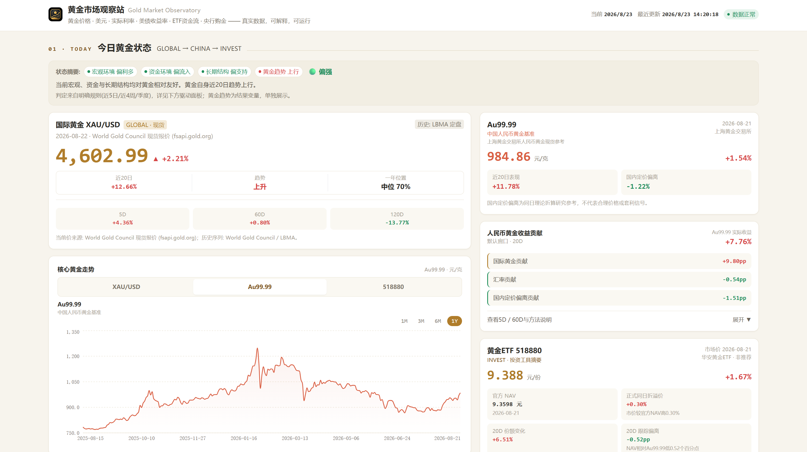
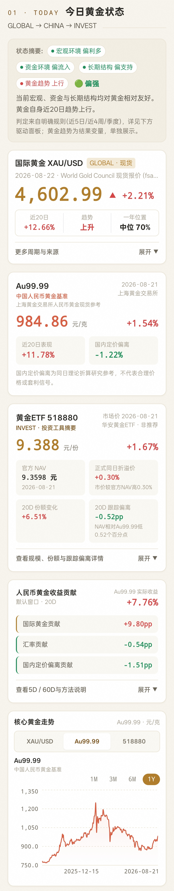

# Gold Market Observatory

**黄金市场观察站**

An open-source gold market observatory connecting global gold markets, China gold prices, ETF flows, macro factors, and central-bank demand.

本项目面向黄金市场研究，尤其关注中国投资者所面对的人民币黄金与黄金 ETF 环境，将国际黄金、人民币汇率、Au99.99、黄金 ETF、实际利率、全球资金流与央行购金数据连接到同一观察框架中。

## Live Demo

**Current public interface: [Refined V4](https://gold-market-observatory.vercel.app/design/refined-v4)**

The repository root route still contains an earlier interface. Use the Refined V4 link above for the current public experience.

## Preview

### Desktop Preview



The desktop view presents the GLOBAL → CHINA → INVEST research framework, with Au99.99 selected in the core gold trend chart and the China gold benchmark, RMB gold return attribution, and representative 518880 ETF summary shown alongside it.

### Mobile Preview



The mobile view uses a readable single-column path from XAU/USD through Au99.99 and 518880 to return attribution and the core trend chart, with secondary information organized through progressive disclosure.

## Why This Project

Finding a gold quote and understanding the environment behind it are different problems. Gold Market Observatory is designed for daily and medium-term research rather than competing with real-time charting platforms, broker terminals, or execution systems.

It brings several questions into one view:

- What does the global gold environment look like?
- Why can RMB-denominated gold behave differently from international gold?
- How is a representative China gold ETF behaving relative to its benchmark?
- What background is provided by ETF flows, real rates, and central-bank demand?

## Research Framework

### GLOBAL

The global layer describes the underlying gold-market environment:

- XAU/USD and LBMA gold-price history
- Broad Dollar Index proxy
- US 10Y real and nominal yields
- US 10Y breakeven inflation
- Global gold ETF holdings and flows
- SPDR Gold Shares (GLD) holdings
- Global central-bank gold demand
- China central-bank gold reserves

### CHINA

The China layer follows the transmission into RMB-denominated gold:

- USD/CNY
- Shanghai Gold Exchange Au99.99 reference
- Theoretical RMB gold reference
- Domestic premium/discount observation
- 5D, 20D, and 60D RMB gold return attribution

Au99.99 period returns are explained in plain language through international-gold contribution, FX contribution, and domestic-pricing-deviation contribution. The deviation term is not a pure measure of domestic supply and demand; it may also reflect trading-hour mismatch, fixing-time differences, market structure, and changes in premiums or discounts.

### INVEST

The investment-tool layer currently uses **518880 华安黄金ETF** as a representative observation instrument. It does not represent every China gold ETF.

The module combines:

- Market price
- Official fund NAV
- Same-date premium/discount
- Shanghai Stock Exchange daily fund shares
- Estimated assets under management
- 5D, 20D, and 60D share changes
- NAV tracking difference versus an Au99.99 proxy benchmark

Premium/discount, tracking difference, and tracking error are distinct concepts. This project currently reports same-date market-price versus NAV premium/discount and NAV-return versus proxy-benchmark tracking difference; it does not label either measure as tracking error.

## Features

- Global and China gold-market dashboard
- Interactive XAU/USD, Au99.99, and 518880 core trend chart
- RMB gold return attribution
- 518880 official NAV, premium/discount, daily shares, and estimated scale
- Global gold ETF holdings and fund-flow monitoring
- Macro environment monitoring
- Central-bank gold-demand context
- Rule-based, explainable market drivers
- Data provenance and freshness tracking
- Responsive desktop and mobile layout
- Daily automated data-refresh pipeline through GitHub Actions

## Data Sources

Source names below follow the current production snapshots and fetch implementation.

| Category | Data | Primary source |
| --- | --- | --- |
| Gold | XAU/USD history | World Gold Council / LBMA |
| China Gold | Au99.99 | World Gold Council (SGE Au99.99) |
| FX | USD/CNY | FRED (St. Louis Fed) |
| Macro | Broad Dollar Index proxy | FRED (St. Louis Fed) |
| Macro | US 10Y Real Rate | FRED (St. Louis Fed) |
| Macro | US 10Y Nominal Yield | FRED (St. Louis Fed) |
| Macro | 10Y Breakeven Inflation | FRED (St. Louis Fed) |
| ETF | Global gold ETF holdings and flows | World Gold Council |
| ETF | SPDR GLD holdings | SPDR Gold Shares / State Street Global Advisors |
| China ETF | 518880 market price | Tencent market data (SSE-listed instrument) |
| China ETF | 518880 official NAV | Huaan Fund official sources |
| China ETF | 518880 daily fund shares | Shanghai Stock Exchange |
| Central Banks | Global gold purchases | World Gold Council, Gold Demand Trends |
| Central Banks | China gold reserves | World Gold Council / IMF IFS |

The Broad Dollar Index is a proxy, not ICE DXY. Au99.99 data is compiled by the World Gold Council in an SGE context. Public market-data endpoints are identified as such and are not presented as official exchange APIs.

## Data Philosophy

- `observation_date` and `fetched_at` are kept separate.
- Each series preserves its native daily, weekly, or quarterly publication frequency.
- Low-frequency observations are never presented as daily data.
- A failed fetch does not silently erase a previous valid snapshot.
- Freshness and quality gates validate snapshots before automated publication.
- Production snapshots contain no Mock data.
- Source provenance, observation dates, fetch times, and frequencies are visible in the interface.

## Automation

```text
GitHub Actions
  → fetch public market data
  → quality and freshness checks
  → substantive-change detection
  → commit updated snapshots
  → Vercel production deployment
```

The pipeline runs daily, while each series preserves its native publication frequency. The browser does not call FRED, the World Gold Council, or SPDR in real time; the application reads versioned JSON snapshots saved at data-refresh time. This supports stability, reproducibility, cost control, and source auditing.

## Not a Real-Time Trading Terminal

Gold Market Observatory is intended for daily and medium-term research. It is not a tick-level market feed, execution platform, arbitrage terminal, real-time IOPV monitor, forecasting service, or personalized recommendation system.

## Tech Stack

- Next.js and React
- TypeScript
- Tailwind CSS
- Recharts
- Node.js
- GitHub Actions
- Vercel

## Local Development

```bash
npm ci
npm run dev
```

Open the current interface at:

```text
http://localhost:3000/design/refined-v4
```

Create a production build with:

```bash
npm run build
npm run start
```

### Data commands

Fetching requires network access and updates the versioned snapshots under `data/`.

```bash
npm run data:fetch
npm run data:fetch -- --only china-etf
npm run data:fetch -- --only china-derived
npm run data:check
npm run data:changes
npm run data:inspect
```

Other supported fetch selectors include `fred`, `wgc`, `spdr`, and `china`.

## Environment Variables

Copy `.env.example` to `.env` when running the data pipeline locally.

| Variable | Requirement | Purpose |
| --- | --- | --- |
| `FRED_API_KEY` | Recommended locally | Uses the official FRED API for more reliable macro and FX retrieval. Without it, the fetcher falls back to `fredgraph.csv` or existing committed snapshots. |
| `HTTP_PROXY` / `HTTPS_PROXY` | Optional | Local network proxy settings for data fetching. |

The scheduled GitHub Actions workflow requires `FRED_API_KEY` as a repository secret. Never commit keys or tokens.

## Project Structure

```text
app/          Next.js routes and layouts
components/   Dashboard UI and chart components
lib/          Data loading, transformation, attribution, and source adapters
data/         Versioned series and derived JSON snapshots
scripts/      Fetch, quality, change-detection, and inspection tools
tests/        Data-contract, attribution, ETF, and quality-gate tests
```

## Contributing

Issues and pull requests are welcome for bug reports, data-source improvements, documentation, and visualization enhancements.

## Disclaimer

This project is for research and educational purposes only and does not constitute investment advice.

本项目仅用于数据研究与市场观察，不构成任何投资建议。
